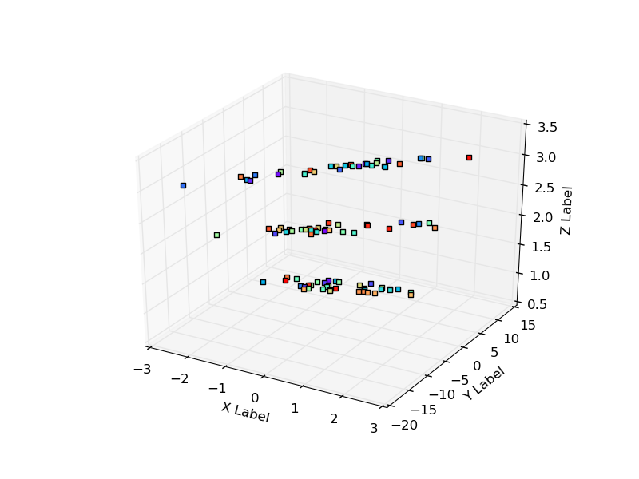
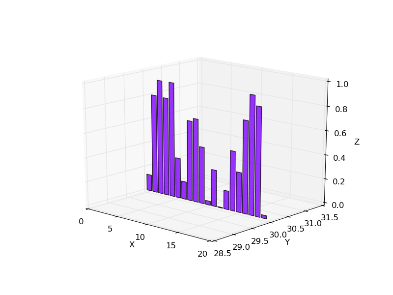

tredify
---

A Python framework to plot 2D and 3D structures from JSON data.

Requirements
---
* matplotlib
* numpy

Use
---
```bash
python tredify.py -i [JSON file path] -t [Plot type] -d [Plot dimension]
```
If you choose 3D dimension, it will be prompt the classical matplotlib GUI

JSON and plots examples
---
**Scatter**
```json
[
 {
 "x": 0.30148,
"y": 2.4615,
"z":      3 
},
{
 "x": -0.29836,
"y": -2.0909,
"z":      2 
},
{
 "x": -1.0465,
"y": -6.3393,
"z":      3 
}
]
```


**Bar**
```json
[
    {
        "DIRECTION": "y"
    },
    {
        "xs": [0,1,2,3,4,5,6,7,8,9,10,11,12,13,14,15,16,17,18,19],
        "ys": [
            0.13637986,
            0.81848763,
            0.94809069,
            0.81352269,
            0.94943976,
            0.33354841,
            0.14769246,
            0.66518745,
            0.6922248,
            0.47103811,
            0.03248075,
            0.30346144,
            0.00491906,
            0.1544151,
            0.4929639,
            0.33019535,
            0.76123614,
            0.97240316,
            0.89122254,
            0.0263647
        ],
        "zs": 30
    }
]
```


**Pie**
```json
[
    {
        "LABEL": "Drama",
        "PERCENTAGE":20,
        "EXPLODE": "False"
    },
    {
        "LABEL": "Scifi",
        "PERCENTAGE":60,
        "EXPLODE": "False" 
    },
    {
        "LABEL": "Action",
        "PERCENTAGE": 10,
        "EXPLODE": "True"
    },
    {
        "LABEL": "Romance",
        "PERCENTAGE": 10,
        "EXPLODE": "True"
    }
]
```


