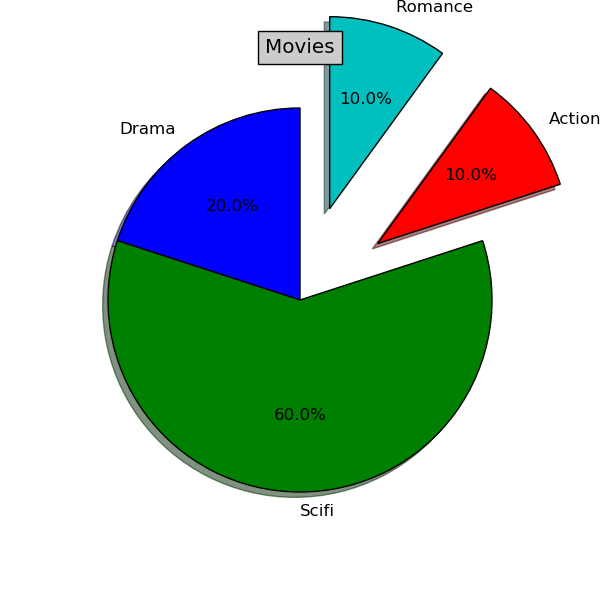

tredify
---

A Python framework to plot 2D and 3D structures from JSON data.

Requirements
---
* matplotlib
* numpy

Install
---
Install dependences with **conda** (recommended)

Download miniconda sh installer [here](http://conda.pydata.org/miniconda.html)

```bash
bash Miniconda-latest-Linux-*.sh
```
```bash
conda install numpy
```

```bash
conda install matplotlib
```
or launch **setup.sh** file
```bash
sudo chmod +x setup.sh
```
```bash
./setup.sh
```

If you also want to manage GIS data, you have to install other requirements:

* GEOS engine and Basemap
```bash
wget http://sourceforge.net/projects/matplotlib/files/matplotlib-toolkits/basemap-1.0.7/basemap-1.0.7.tar.gz
tar -xzvf basemap-1.0.7.tar.gz
cd basemap-1.0.7/geos-3.3.3/
export GEOS_DIR=/usr/local/
./configure --prefix=$GEOS_DIR
make
sudo make install
cd ..
sudo python setup.py install
```
* geojson
```bash
echo "deb http://archive.ubuntu.com/ubuntu/ vivid universe" | sudo tee -a "/etc/apt/sources.list"
sudo apt-get install python-pip
sudo pip install geojson
```

Use
---
```bash
python tredify.py -i {JSON file path} -t {bar,scatter,pie} -d {2D,3D} -v {gui,image}
```
If you choose GUI view, it will be prompt the classical matplotlib interface

To generate structures from geoJSON file:

```bash
python tredify.py -i {JSON file path} -gis {geoJSON structure [point,linestring,...]}
```

Stable Release
---
Clone master branch of this repo:
```bash
git clone https://github.com/gsalvatori/tredify/
```
or download the latest release from [here](https://github.com/gsalvatori/tredify/releases)

Development release
---
```bash
git clone -b development https://github.com/gsalvatori/tredify/
```

JSON and plots examples
---
**Scatter**
```json
[
    {
        "x": 0.30148,
        "y": 2.4615,
        "z": 3
    },
    {
        "x": -0.29836,
        "y": -2.0909,
        "z": 2
    },
    {
        "x": -1.0465,
        "y": -6.3393,
        "z": 3
    }
]
```


**Bar**
```json
[
    {
        "DIRECTION": "y"
    },
    {
        "xs": [0,1,2,3,4,5,6,7,8,9,10,11,12,13,14,15,16,17,18,19],
        "ys": [
            0.13637986,
            0.81848763,
            0.94809069,
            0.81352269,
            0.94943976,
            0.33354841,
            0.14769246,
            0.66518745,
            0.6922248,
            0.47103811,
            0.03248075,
            0.30346144,
            0.00491906,
            0.1544151,
            0.4929639,
            0.33019535,
            0.76123614,
            0.97240316,
            0.89122254,
            0.0263647
        ],
        "zs": 30
    }
]
```


**Pie**
```json
[
    {
        "LABEL": "Drama",
        "PERCENTAGE":20,
        "EXPLODE": "False"
    },
    {
        "LABEL": "Scifi",
        "PERCENTAGE":60,
        "EXPLODE": "False" 
    },
    {
        "LABEL": "Action",
        "PERCENTAGE": 10,
        "EXPLODE": "True"
    },
    {
        "LABEL": "Romance",
        "PERCENTAGE": 10,
        "EXPLODE": "True"
    }
]
```


other features soon...


