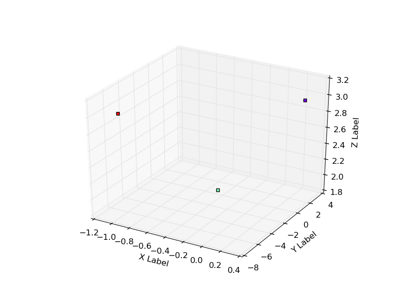

tredify
---

A Python framework to plot 2D and 3D structures from JSON data.

Requirements
---
* matplotlib
* numpy

Use
---
```bash
python tredify.py -i [JSON file path] -t [Plot type] -d [Plot dimension]
```

JSON examples and plots
---
**Scatter**
```json
[
 {
 "x": 0.30148,
"y": 2.4615,
"z":      3 
},
{
 "x": -0.29836,
"y": -2.0909,
"z":      2 
},
{
 "x": -1.0465,
"y": -6.3393,
"z":      3 
}
]
```

